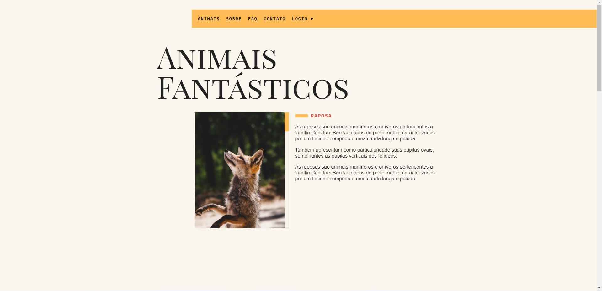
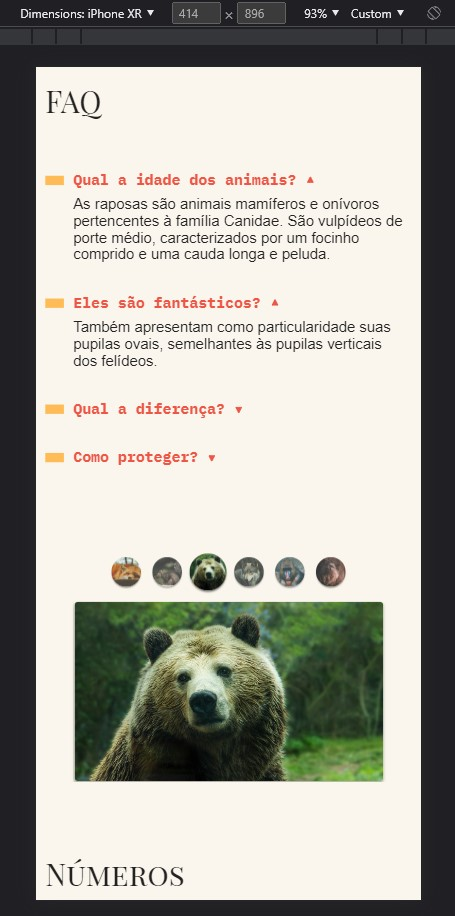

<h1>🦊 Animais Fantásticos 🦊</h1>

<!-- LINKS -->

 
 <h2> Sumário</h2>
 
 <a href="#fotos">Fotos</a> - 
  <a href="#GIFs">GIFs</a> - 
  <a href="#sobre">Sobre o Projeto</a> - 
  <a href="#tec">Tecnologias</a>

 

<!-- FOTOS -->

    <h2> 📸 Fotos </h2>
        
          
       
 <h2> 📱 Responsivo </h2>
    
          
        
   <h2 id="GIFs"> 🎥 GIFs </h2>
        
          

<!-- SOBRE -->

    <h2> 📝 Sobre o Projeto </h2> 
    
 Animais Fantásticos, um projeto que fala um pouco sobre algumas espécies de animais. O projeto foi feito totalmente a "mão" e utilizando somente JavaScript, sem nenhum framework. Nele, foi usado classes, fetch API entre diversas outras funcionalidades ES6+. 

 
 <h3 align="center">Link do Projeto <a href="https://lucasfrancobn.github.io/Bikecraft/">CLIQUE AQUI</a></h3>

 

<!-- TECNOLOGIAS -->

<h2> 🖥️ Tecnologias</h2>
    
 ✔️ HTML 5 

    
 ✔️ CSS 3 

    
 ✔️ JavaScript 

    
 ✔️ Webpack 

    
 ✔️ Babel 

    
 ✔️ ESLint 

    
 ✔️ UI/UX Design 

